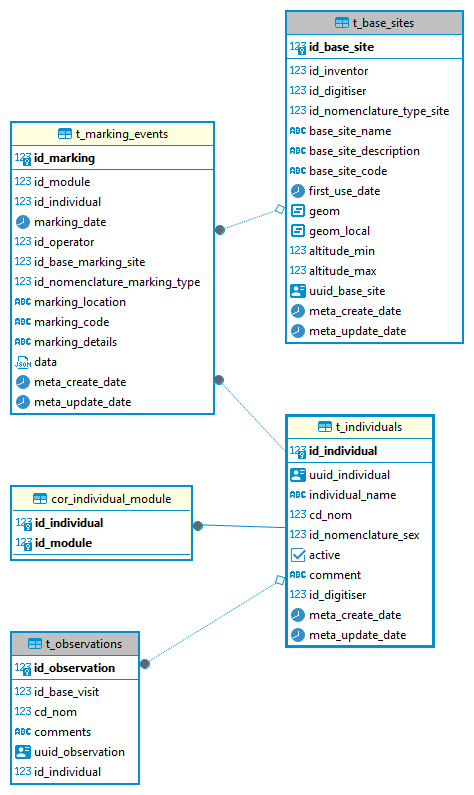
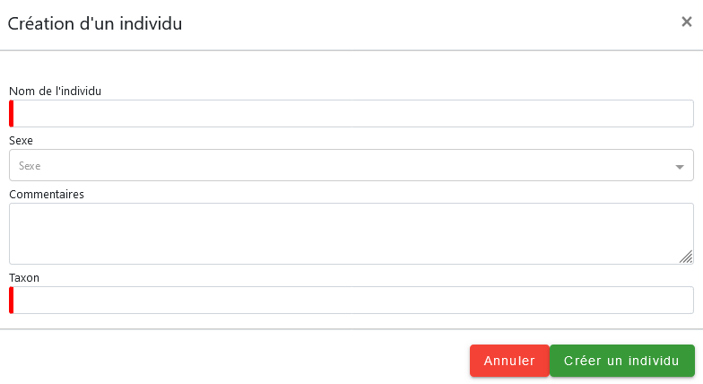

# Gestion des individus

## Introduction
Le suivi d'individu, tel qu'il est implémenté dans le module monitoring, 
permet de :

- Créer des individus
- Créer des marquages associés aux individus (un individu peut 
  avoir plusieurs marquages)
- Partager des individus entre les modules

## Base de données

Le schéma de base de données est le suivant :


Les tables en grises sont présentes à des fins de compréhension.

## Nomenclature

Le type de marquage est stocké comme une nomenclature dont le type 
est `TYP_MARQUAGE`. Ce type a été spécialement créé pour le marquage des
individus.

## Implémentation dans le module

Il y a donc 2 objets déclarés dans le module : 
- `individual`
- `marking`

L'objet marking doit être un enfant de l'objet individual. Dans 
le fichier `config.json` d'un sous module, il suffit de déclarer
le `tree` comme suit :

```json
"tree": {
    "module": {
      "site": {
        "visit": {
          "observation": null
        }
      },
      "individual": {
        "marking": null
      }
    }
  }
```

L'objet individual peut-être inséré comme tel pour créer un onglet
au même niveau que le site afin d'avoir la liste d'individus 
facilement accessible.

Il n'est actuellement pas possible de renseigner de champs personnalisés 
sur les individus via la création d'un fichier `individual.json` 
comme c'est le cas pour les autres objets. 
Cette impossibilité émane du fait que le [widget individu](#le-widget-individu), 
créé côté GeoNature, propose un formulaire de création disposant de champs 
fixes qui ne doit donc différer du formulaire côté monitoring.

## Le widget individu

Ce widget, disponible dans les composants de GeoNature, permet de :

- Sélectionner un individu déjà présent
- Créer un nouvel individu

Il se présente comme tel :


Et en cliquant sur le "+", un formulaire de création d'individu apparaîtra :



Il est paramétrable en json comme ceci : 

```json
"id_individual": {
    "type_widget": "individuals",
    "attribut_label": "Choix de l'individu",
    "id_module": "__MODULE.ID_MODULE",
    "id_list": "__MODULE.ID_LIST_TAXONOMY",
    "cd_nom": "__MODULE.CD_NOM"
}
```

Les attributs sont optionnels si le contraire n'est pas spécifié et sont les suivants :

- `id_module` (**obligatoire**) : permet de spécifier le module auxquel 
  doivent être rattachés les individus proposés dans le menu déroulant.
  Il est obligatoire pour assurer le calcul de permissions de 
  l'utilisateur en "Read" et en "Create".
- `id_list` : dans le formulaire de saisie, restreint la saisie d'espèce à
  une liste taxonomique
- `cd_nom` : fixe le champ Taxon au cd_nom donné et donc ne le fait pas
  apparaître dans le formulaire.


## Cas de l'observation

Pour que les individus soient implémentés dans le module, la contrainte 
`NOT NULL` sur la colonne `cd_nom` de `gn_monitoring.t_observations` a dû 
être supprimée au profit d'une contrainte `NOT NULL` sur la colonne `cd_nom`
**OU** la nouvelle colonne `id_individual`.

Pour pouvoir donc saisir des individus au lieu d'espèces dans une observation,
la configuration minimale du fichier `observation.json` doit être la suivante :

```json
{
  "specific": {
    "cd_nom": {
       "type_widget": "text",
       "required": false,
       "hidden": true
    },
    "id_individual": {
      "type_widget": "individuals",
      "attribut_label": "Choix de l'individu",
      "id_module": "__MODULE.ID_MODULE",
      "id_list": "__MODULE.ID_LIST_TAXONOMY",
      "hidden": false
    }
  }
}
```

Elle permet de désactiver la saisie du `cd_nom` au profit de l'individu.

## Permissions

Comme tout objet monitoring, des permissions seront ajoutées à l'installation 
pour CRUD sur les objets `MONITORINGS_INDIVIDUALS` et `MONITORINGS_MARKINGS`.

